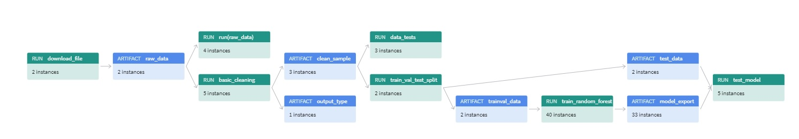

# Build an ML Pipeline for Short-Term Rental Prices in NYC

* GitHub Project Link: https://github.com/sakthi-t/build-ml-pipeline-for-short-term-rental-prices.git
* Wandb Project Link: https://wandb.ai/t-shakthi/nyc_airbnb

# Notes
* I have updates all the dependencies in conda.yml to it's newest version
* Since dependencies are updated to newest version there were conflicts since Udacity components repository uses old version of scikit-learn
* To avoid conflicts I have used my own components repository in config.yaml like this https://github.com/sakthi-t/build-ml-pipeline-for-short-term-rental-prices#components
* I have referred to my own components repository under pip dependencies in test_regression_model and train_val_test_split
* MLflow is moved under pip dependencies in all conda.yml. Having MLflow under the conda dependencies takes hours to solve the environment

# Exploratory Data Analysis
* There is a sample data in wandb
* Have utilized a jupyter notebook in src/eda/EDA.ipynb
* The sample.csv is fetched from the wandb
* The data is cleaned

# Data Cleaning
* Created a basic_cleaning step following the cookie cutter code
* Updated the conda.yml
* Updated all the parameters
* Runs basic_cleaning step without errors
* Created clean_sample.csv in wandb

# Data Testing
* A 'reference' tag has been created for clean_sample.csv
* v2 is the latest clean_sample.csv and v0 is the reference clean_sample.csv
* Implemented test_row_count and test_price_range

# Data Splitting
* The data is split into train and test splits
* There are two new artifacts test_data containing test_data.csv and trainval_data containing trainval_data.csv

# Train the Random Forest
* The data is downloaded from wandb
* The get_inference_pipeline method is implemented
* An artifact 'model_export' containing random_forest_export is created in wandb
* Optimized the hyperparameters
* The best model is selected with the tag 'prod'. In this case it is v28. 

# Test Set Verification
* The test set is created and verified

# Pipeline Visualization

# Pipeline Release
* Two releases 1.0.0 and 1.0.1 are made in total

# Train the Model on a New Data Sample
* The pipeline (1.0.0) was run on new data and it failed
* Few more steps related to boundary are added in basic cleaning
* The release is updated to 1.0.1
* The pipeline (1.0.1) was run on new data (sample2.csv) successfully
